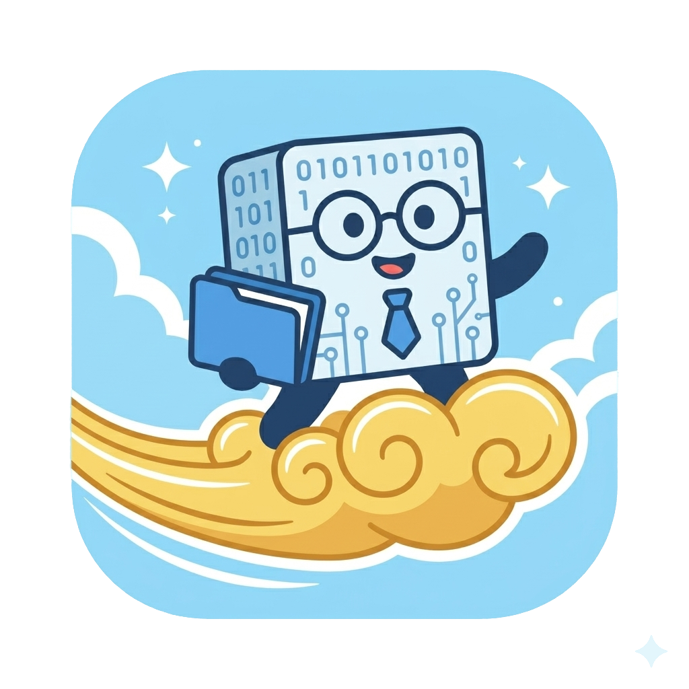
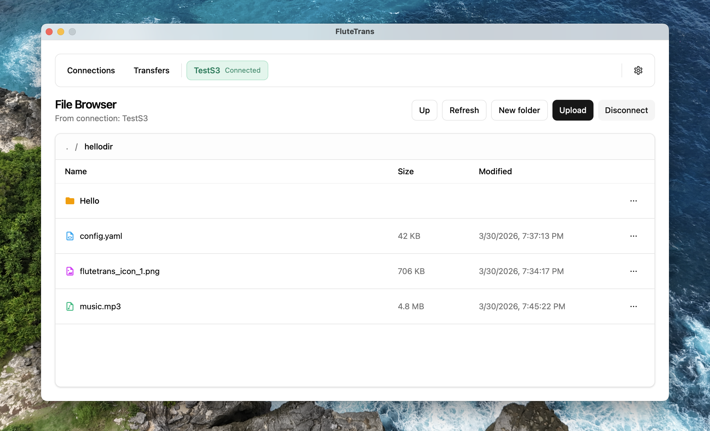

English version | [中文版](README_cn.md) 

# FluteTrans

<p align="center">
  
</p>

FluteTrans is a cross-platform desktop app for file transfer and remote file management. It supports multiple common protocols (FTP/SFTP/WebDAV/SMB/NFS/S3). The project uses Wails (Go) for the backend and Svelte + Vite for the frontend, providing connection management, file browsing, uploads/downloads, and a transfer queue.

## Features

- Multi-protocol connection management: save profiles, connect/disconnect quickly
- Remote file browsing: directory listing and basic file metadata
- Upload/Download: transfer progress and a transfer task list
- Local credential encryption: encrypt saved credentials with a “master password”, supports lock and password rotation
- Multi-language: defaults to the OS language; persists the user’s selection after manual change

## Supported Protocols

- FTP
- SFTP
- WebDAV
- SMB
- NFSv3
- S3 (S3-compatible object storage)

## Screenshot

<p align="center">
  
</p>

## Tech Stack

- Backend: Go + Wails v2
- Frontend: Svelte 5 + Vite 6 + TailwindCSS

## Quick Start (Development)

### Prerequisites

- Go (see the `go`/`toolchain` requirements in `app/go.mod`)
- Node.js (18+ recommended)
- Wails CLI (v2)

### Run in Dev Mode

```bash
cd app
wails dev
```

This starts the frontend dev server with HMR and binds to the Go backend via the Wails runtime.

## Build a Release Package

```bash
cd app
wails build
```

Build outputs are platform-specific. Wails will generate a distributable app bundle in the build output directory.

## Security & Data Storage

- Connection data is stored in an encrypted file under the user config directory (`connections.json.enc`).
- The encryption key is derived from the “master password”. The master password is never uploaded.
- Changing the master password rotates the encrypted store by decrypting with the old password and re-encrypting with the new one.

## Project Structure

- `app/`: Wails application (Go backend + build configuration)
  - `app/internal/`: backend core (protocol adapters, sessions, transfers, encrypted storage)
  - `app/frontend/`: Svelte frontend

## Contributing

Issues and pull requests are welcome, especially for:

- Bug fixes and protocol compatibility improvements
- UI/UX improvements
- Tests and release/CI enhancements

## License

This project is licensed under the GNU Affero General Public License v3.0. See [LICENSE](file:///Users/flute/Documents/develop/fluteTrans/LICENSE).
